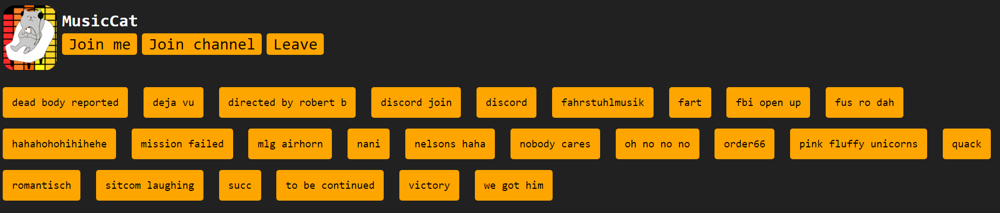

# **MusicCat**

<a href="discord.gg/Ra4WSRYWk6"><a>

 

## Table of contents
- [About](#about)
- [Installation](#installation)
- [Dashboard preview](#Dashboard-preview)
- [Errors, Bugs & Feedback](#Errors,-Bugs-&-Feedback)
- [Help](#help)
- [License](#license)

## About
MusicCat is a Discord bot which can play audio files. This can be used with the Web-Dashboard as soundboard.
The bot comes with 25 audio files and more can be added easily.
You have to host the bot on your PC!

 

## Installation
You can find the installation guide on my [website]

 

## Dashboard preview

 

## Errors, Bugs & Feedback
To report bugs or errors you can open an issue on GitHub or join my [Discord Server].  
If you create a new issue just make sure that it hasn't already been reported.  
Feedback is also welcome on my [Discord Server]

 

## Help
If you have problems, please don't hesitate to join my [Discord Server]

 

## License
The [MIT] License can be found [here]

[website]: https://zorks.de/musiccat
[Discord Server]: https://zorks.de/server
[MIT]: https://choosealicense.com/licenses/mit/
[here]: https://github.com/BenediktWutzke/MusicCat/blob/main/LICENSE